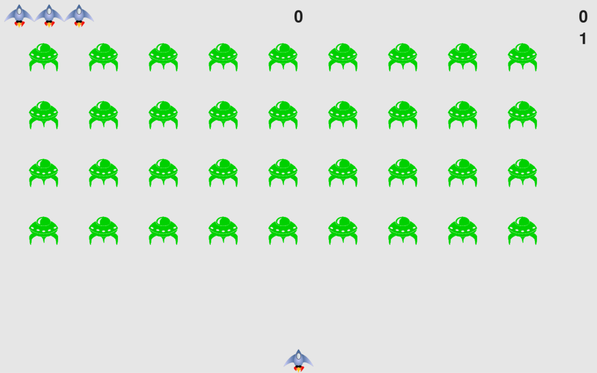

# Alien Invasion 🛸

## Table of Contents
- [Introduction](#introduction)
- [How to Build](#how-to-build)
- 
## Introduction
This is a simple shooting arcade-style video game created with Pygame. In Alien Invasion the player controls a ship that appears at the bottom center of the screen. The player can move the ship using the left and right arrow keys and shoot bullets with the space bar. When  the game begins a fleet of aliens appear moving toward the ship. The player shoots and destroys the aliens. If the player shoots all the aliens a new fleet appears that is faster than the previous one. If any alien hits the player's ship or reaches the bottom of the screen, the player loses a ship. If three ships are lost, the game ends.

## How to Build

## How to Run

## How to Use

## License

